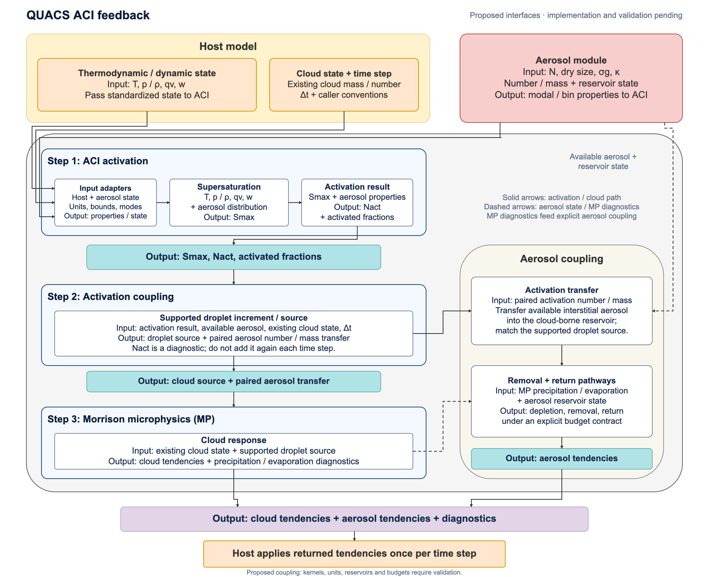

# Aerosol–cloud interaction (ACI): proposed interfaces

This directory documents a proposed QUACS workflow connecting host state,
aerosol activation, Morrison microphysics (MP), and explicit aerosol coupling.
The diagram is a design proposal, not an implemented or scientifically
validated parameterization. No physical kernels or executable API are provided.

Open [the editable draw.io source](diagrams/aci_workflow.drawio) in draw.io;
nodes, labels, and connectors can be edited separately. An
[SVG preview](diagrams/aci_workflow.svg) is also available. The source uses
an 1883 × 1531 canvas, Arial, and the colors and step layout adapted from the
repository's [plume-rise diagram](https://github.com/NCAR/quacs-parameterization/blob/03fa9f350d91794efb3935c0552c02da4364aa65/quacs/plumerise/diagrams/plumerise_workflow.drawio).
The plume-rise source remains unchanged. These previews are local geometry
and text renders of the editable XML; they are not copies of the earlier ACI
Library image.

## Proposed inputs and outputs

| Component | Inputs | Outputs / responsibility |
| --- | --- | --- |
| Host | Temperature `T`, pressure `p` / air density `ρ`, water vapor `qv`, vertical velocity `w`, existing cloud mass / number, and time step `Δt` | Provide state and caller conventions; apply returned cloud and aerosol tendencies once per time step. |
| Aerosol module | Number `N`, dry size, geometric width `σg`, hygroscopicity `κ`, and aerosol number / mass reservoir state | Supply modal or bin properties and available aerosol to the adapters and coupling layer. |
| ACI activation | Adapted host and aerosol properties | Diagnose maximum supersaturation `Smax`, activated number `Nact`, and activated fractions. |
| Activation coupling | Activation results, available aerosol, existing cloud state, and `Δt` | Produce the droplet increment or source supported by the selected MP interface and its paired aerosol number / mass transfer. |
| Morrison MP | Existing cloud state and supported droplet source | Return cloud response / tendencies and precipitation / evaporation diagnostics. |
| Aerosol coupling | Paired activation number / mass transfer, reservoir state, and MP diagnostics | Account for interstitial-to-cloud-borne transfer and proposed depletion, removal, and evaporation return; return aerosol tendencies under an explicit budget contract. |

`Nact` is an activation diagnostic, not a source that can simply be added again
each time step. The source conversion must honor the selected activation and
MP interfaces, available aerosol, and existing cloud state; this proposal does
not define a universal `Nact - Nd` formula. Pressure or density, number
concentration or mixing ratio, size definitions, water-vapor conventions,
and increment versus rate must be resolved by adapters. Candidate SI quantities
are K, Pa, kg m^-3, kg kg^-1, m s^-1, and s; the diagram does not establish
a callable unit contract.

The aerosol coupling layer owns the proposed aerosol bookkeeping. The diagram
does not imply that bare Morrison MP implements every aerosol sink or return
pathway. Implementation requires explicit reservoir definitions, ownership of
scavenging and evaporation return, compatible source and tendency units,
call order, conservation / positivity checks, and protection against repeated
activation or duplicate tendency application.

## Provenance and review status

The editable PRM diagram at commit `03fa9f350d91794efb3935c0552c02da4364aa65`
supplies the visual template; its source SHA-256 is
`d14ea67bfa7bf9fbb4524ceb0fd8dd3c11b80f31bbad0834d5ca1e538a4cea1c`.
The ACI contents express the proposed interfaces above. Visual / XML review
checks document readability and editability, not scientific correctness.
Kernels, host call location, source contracts, aerosol budgets, and validation
remain to be selected and reviewed before code is added.

## Scientific background

These references provide background; no implementation parity is claimed.

- Abdul-Razzak, H. and Ghan, S. J. (2000). *A parameterization of aerosol activation: 2. Multiple aerosol types*. [doi:10.1029/1999JD901161](https://agupubs.onlinelibrary.wiley.com/doi/10.1029/1999JD901161).
- Petters, M. D. and Kreidenweis, S. M. (2007). *A single parameter representation of hygroscopic growth and cloud condensation nucleus activity*. [Atmospheric Chemistry and Physics, 7, 1961–1971](https://acp.copernicus.org/articles/7/1961/2007/).
- The WRF project's [aerosol-aware Morrison module](https://github.com/wrf-model/WRF/blob/master/phys/module_mp_morr_two_moment_aero.F) is a separate source reference for later interface review. Selection of an MP variant and its coupling details remains open.
