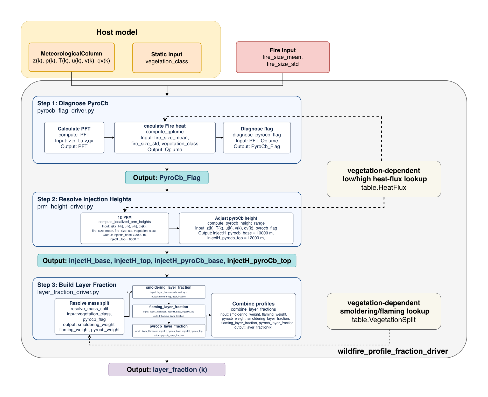

# Plume Rise

`quacs.plumerise` is a small Python reference workflow for converting one
wildfire column into a normalized vertical `layer_fraction[k]` profile. It is
written as a direct-input QUACS contract: the public driver accepts
meteorological arrays, vegetation class, and fire-size variables, then returns
only the layer fraction.



## What It Does

The workflow is intentionally narrow and executable. It does not include species
dimensions, host-model adapters, or emission-file parsing.

- Step 1 diagnoses `pyrocb_flag` from a pyrometeopy-style PFT calculation and a
  vegetation-dependent fire heat-flux proxy.
- Step 2 returns direct injection-height variables. The current simplified
  baseline PRM height is prescribed as `3000-6000 m AGL`.
- Step 3 converts direct mass-split and height variables into the normalized
  output `layer_fraction[k]`.

Main public entry point:

```python
from quacs.plumerise import compute_wildfire_profile_fraction_driver

layer_fraction = compute_wildfire_profile_fraction_driver(
    z,
    p,
    t,
    u,
    v,
    qv,
    vegetation_class,
    fire_size_mean,
    fire_size_std=0.0,
)
```

## Inputs And Output

The public driver accepts direct variables, not pre-built column, fire, or
vegetation dictionaries:

- `z` in m AGL
- `p` in hPa
- `t` in K
- `u`, `v` in m s^-1
- `qv` in kg kg^-1
- `vegetation_class` as a lookup key
- `fire_size_mean` and optional `fire_size_std` in m^2

The output is unitless `layer_fraction[k]`, normalized over the model layers.
Detailed units and step contracts are in `docs/workflow_contract.md`.

## Quick Start

From this repository:

```bash
python3 -m pip install -e .
python3 quacs/plumerise/examples/run_single_column_workflow.py
python3 -m pytest -q quacs/plumerise/tests
```

From a source checkout without installing:

```bash
PYTHONPATH=. python3 quacs/plumerise/examples/run_single_column_workflow.py
PYTHONPATH=. python3 -m pytest -q quacs/plumerise/tests
```

## Notebook Walkthrough

The example notebook starts with a synthetic sounding, then runs Step 1, Step 2,
Step 3, and the full public driver:

```bash
python3 -m jupyter nbconvert --execute --to notebook --inplace quacs/plumerise/examples/single_column_workflow_steps.ipynb
```

## Repository Layout

```text
quacs/plumerise/                 Python package and three step drivers
quacs/plumerise/examples/        Script and notebook examples
quacs/plumerise/tests/           Contract tests
quacs/plumerise/docs/            Detailed input-process-output contract
quacs/plumerise/diagrams/        Workflow diagram source and PNG
```

## Scope Notes

This repository is a reference contract, not a full atmospheric host-model
coupler. Tables for vegetation split and heat flux are internal defaults for
the current simplified workflow.
