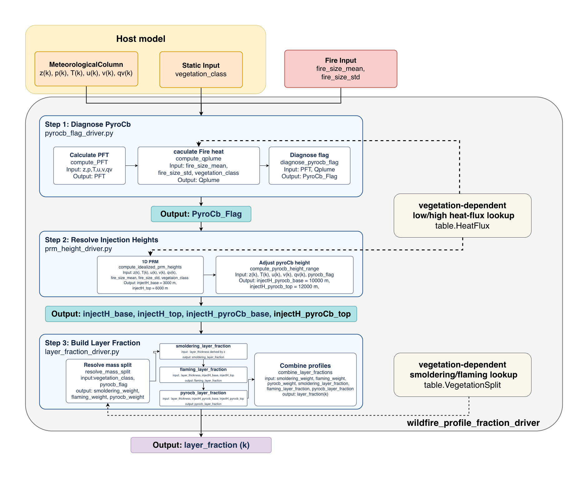

# plumerise/freitas_pyrocb: pyroCb-aware plume rise

| | |
|---|---|
| **Status** | in progress |
| **Target class** | pyroCb aware plume rise |
| **Contributors** | ChenHau-Lan (U Albany), from [PR #9](https://github.com/NCAR/quacs-parameterization/pull/9) |
| **Original source** | Freitas et al. (2010) 1-D plume rise model; pyroCb trigger after Peterson et al. (2017) |

This scheme converts one wildfire column into a normalized vertical profile `layer_fraction[k]`.
The profile tells the fraction of the fire emissions that goes into each model layer.
The scheme first diagnoses if the fire can make a pyrocumulonimbus (pyroCb).
If the fire can make a pyroCb, the scheme injects a fraction of the smoke near the tropopause.

The current code is a reference workflow with these limits:

- Step 2 does not run the Freitas plume rise model yet. It returns a fixed injection height range of 3000 m to 6000 m.
- The vegetation mass split table and the heat flux table contain placeholder values.



## Target parameterization template

| Field | Value |
|---|---|
| Research area | Aerosol and smoke plume |
| Scheme specifics | Freitas 1-D plume rise (Freitas et al., 2010) with a pyroCb trigger |
| External datasets | Fire emissions and fire radiative power (FRP). This code uses the fire size and a heat flux for each vegetation class. |
| Information from MPAS-A | Ambient environment: stability, mid-level moisture, upper-level divergence. This code uses the profiles of `z`, `p`, `t`, `u`, `v`, and `qv`. |
| Other inputs | Vegetation class, fire size, lookup tables for the smoldering and flaming mass split and the heat flux |
| Information to MPAS-A | The vertical distribution of smoke emissions. If the scheme flags a pyroCb, a fraction of the smoke goes into the upper troposphere and lower stratosphere. |
| Considerations | The scheme must handle a regime change between the normal mode and the pyroCb mode. |
| Equations and references | Add a pyroCb trigger to the 1-D scheme, after the framework of Peterson et al. (2017). Link the smoke updraft back to the host model, after Ma and Jones (2025). |

## Classification

| Dimension | Value |
|---|---|
| Complexity | complex |
| Solving strategy | discrete state update |
| Aerosol representation | any |
| Grid | 1-D (column) |
| Interdependence | needs fire emissions |

## Workflow

The public driver `compute_wildfire_profile_fraction_driver` calls 3 steps.

| Step | Module | Function | Output | Unit |
|---|---|---|---|---|
| Outer driver | `wildfire_profile_fraction_driver.py` | `compute_wildfire_profile_fraction_driver` | `layer_fraction[k]` | 1 |
| 1 | `pyrocb_flag_driver.py` | `pyrocb_flag_driver` | `pyrocb_flag` | boolean |
| 2 | `prm_height_driver.py` | `prm_height_driver` | `injectH_base_m`, `injectH_top_m`, `injectH_pyroCb_base_m`, `injectH_pyroCb_top_m` | m AGL |
| 3 | `layer_fraction_driver.py` | `layer_fraction_driver` | `layer_fraction[k]` | 1 |

Step 1 compares the plume heat power `qplume` with the pyroCb firepower threshold `PFT`.
`qplume` comes from the fire size and the heat flux of the vegetation class.
`PFT` comes from the sounding. If `qplume >= PFT`, then `pyrocb_flag` is true.

Step 2 gives the baseline injection height range.
If `pyrocb_flag` is true, step 2 also finds the WMO lapse-rate tropopause and gives a range of 2000 m on each side of it.

Step 3 splits the mass into smoldering, flaming, and pyroCb parts:

- The smoldering part goes into the lowest layer.
- The flaming part goes uniformly into the baseline height range.
- If `pyrocb_flag` is true, the pyroCb part is 0.5 of the total mass. It goes uniformly into the pyroCb height range.

## Inputs

Source is one of: MPAS-A, external dataset, constant, other parameterization.

| Name | Description | Units | Shape | Source |
|---|---|---|---|---|
| `z` | Height of each level above ground, increasing | m | `(nlev,)` | MPAS-A |
| `p` | Pressure on `z`, decreasing | hPa | `(nlev,)` | MPAS-A |
| `t` | Temperature on `z` | K | `(nlev,)` | MPAS-A |
| `u` | Zonal wind on `z` | m s-1 | `(nlev,)` | MPAS-A |
| `v` | Meridional wind on `z` | m s-1 | `(nlev,)` | MPAS-A |
| `qv` | Water vapor specific humidity on `z` | kg kg-1 | `(nlev,)` | MPAS-A |
| `vegetation_class` | Vegetation key: `forest`, `savanna`, `grassland`, `shrubland`, or `default` | 1 | scalar (string) | external dataset |
| `fire_size_mean` | Mean fire area | m2 | scalar | external dataset |
| `fire_size_std` | Fire area uncertainty for the high-bound firepower (default 0.0) | m2 | scalar | external dataset |

## Outputs

Destination is one of: MPAS-A state, MICM rate parameter, diagnostic.

| Name | Description | Units | Shape | Destination |
|---|---|---|---|---|
| `layer_fraction` | Fraction of the fire emissions in each layer. The sum over `k` is 1. | 1 | `(nlev,)` | MPAS-A state (multiplies the emission flux) |
| `pyrocb_flag` | True if the fire can make a pyroCb (step 1) | boolean | scalar | diagnostic |
| `injectH_base_m`, `injectH_top_m` | Baseline injection height range (step 2) | m AGL | scalar | diagnostic |
| `injectH_pyroCb_base_m`, `injectH_pyroCb_top_m` | pyroCb injection height range, or `None` (step 2) | m AGL | scalar | diagnostic |

## Usage

```python
from quacs.plumerise.freitas_pyrocb import compute_wildfire_profile_fraction_driver

layer_fraction = compute_wildfire_profile_fraction_driver(
    z, p, t, u, v, qv, vegetation_class, fire_size_mean, fire_size_std=0.0
)
```

| Example | What it does |
|---|---|
| `examples/run_single_column_workflow.py` | Runs the outer driver for one synthetic sounding and prints `layer_fraction` |
| `examples/single_column_workflow_steps.ipynb` | Runs each step one at a time and checks that the result agrees with the outer driver |

The `diagrams/` folder holds the workflow diagram as a draw.io file and a PNG.

## Tests

```bash
pytest quacs/plumerise/freitas_pyrocb
```

## References

- Freitas, S. R., Longo, K. M., Trentmann, J., and Latham, D. (2010). Technical Note: Sensitivity of 1-D smoke plume rise models to the inclusion of environmental wind drag. Atmos. Chem. Phys., 10, 585-594. https://doi.org/10.5194/acp-10-585-2010
- Peterson, D. A., Hyer, E. J., Campbell, J. R., Solbrig, J. E., and Fromm, M. D. (2017). A conceptual model for development of intense pyrocumulonimbus in western North America. Mon. Weather Rev., 145, 2235-2255. https://doi.org/10.1175/MWR-D-16-0232.1
- Tory, K. J., Thurston, W., and Kepert, J. D. (2018). Thermodynamics of pyrocumulus: a conceptual study. Mon. Weather Rev., 146, 2579-2598. https://doi.org/10.1175/MWR-D-17-0377.1
- Ma and Jones (2025). (Full citation to be added.)
